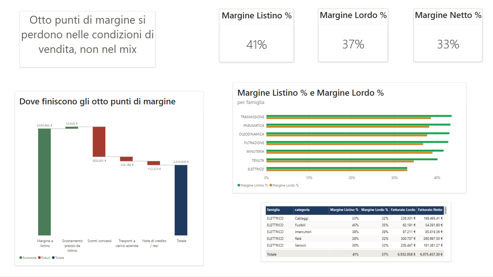
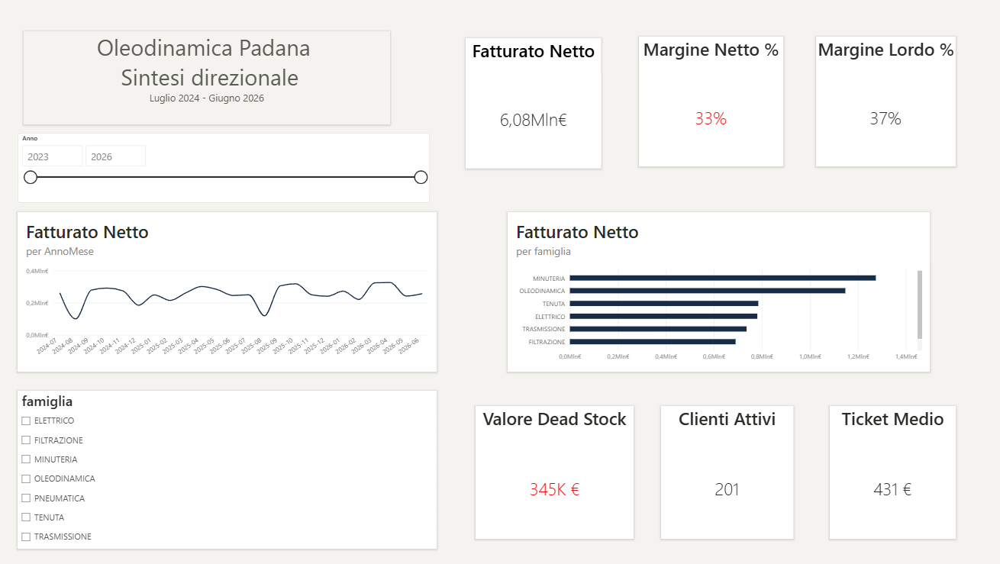
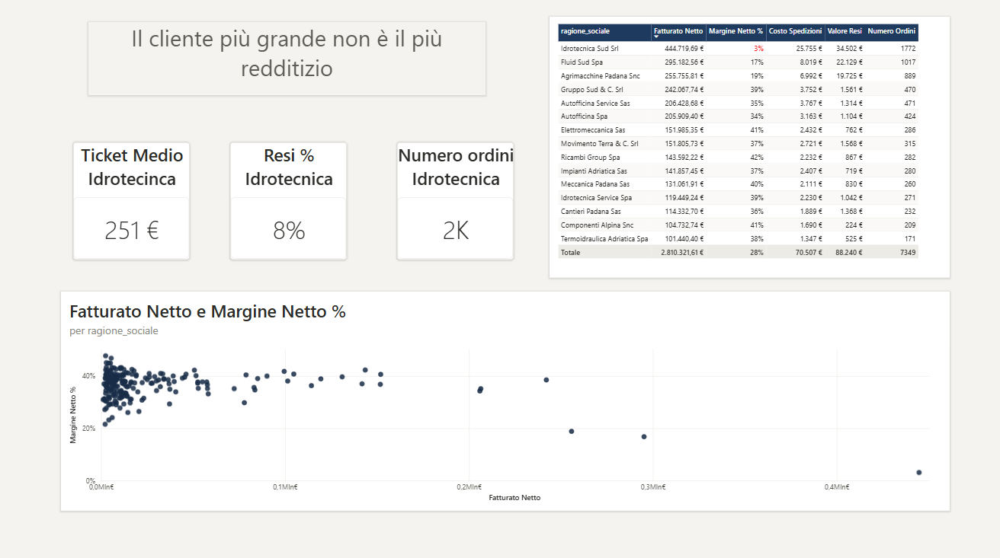
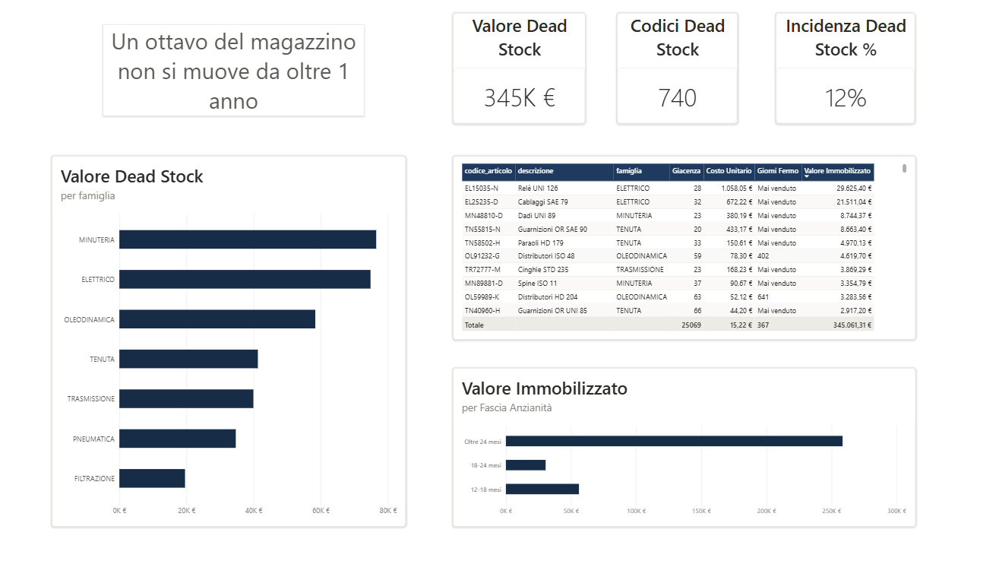
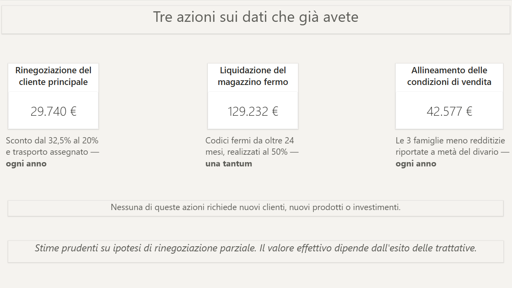

# Dove si perde il margine in una PMI industriale

Analisi di controllo di gestione su un distributore di componentistica industriale
(azienda simulata): 6 milioni di fatturato, 200 clienti, 3.000 codici a magazzino,
24 mesi di dati.

Il progetto parte da cinque export grezzi di un gestionale e arriva a tre azioni
quantificate in euro.

**[→ Leggi il report completo (PDF)](report/caso-studio-oleodinamica-padana.pdf)**



---

## Il risultato in tre numeri

| | |
|---|---|
| **444.720 €** | fatturati al cliente principale, con il 3% di margine netto contro una media aziendale del 33% |
| **345.000 €** | fermi in magazzino da oltre dodici mesi — due mesi di fatturato immobilizzati |
| **1,04 Mln €** | di margine perso tra il listino e l'incasso — lo sconto in trattativa da solo ne vale il 78% |

Recupero stimato: **≈ 201.500 € il primo anno**, di cui 72.300 € ricorrenti.

---

## Cosa non funzionava nei dati

Prima di qualsiasi grafico, sei problemi negli export del gestionale. Nessuno
generava un errore visibile; ognuno produceva numeri sbagliati.

| # | Problema | Effetto se non corretto |
|---|---|---|
| 1 | Date in due formati nella stessa colonna | ~9% degli ordini nel mese sbagliato, stagionalità inventata |
| 2 | Separatori decimali incoerenti | Valori moltiplicati per 100 su parte delle righe |
| 3 | Costo d'acquisto mancante su 105 articoli | Margine al 100% su quegli articoli, famiglie intere gonfiate |
| 4 | Sei anagrafiche cliente duplicate | Conteggio clienti errato |
| 5 | Codici articolo duplicati per uno spazio finale | Giacenza e vendite spezzate su due righe |
| 6 | Costo di trasporto solo sulla prima riga d'ordine | Trasporto moltiplicato per il numero di righe |

La correzione del solo punto 3 ha alzato il costo del venduto di 132.000 € e
abbassato il margine lordo reale di due punti.

---

## Il modello

Schema a stella su sette tabelle:

```
anagrafica_articoli ─┐
anagrafica_clienti ──┼─► righe_ordine ◄── Calendario
movimenti_magazzino ─┤
note_credito ────────┘
_Misure  (tabella dedicata alle misure DAX)
```

Circa 60 misure DAX organizzate in cartelle: fatturato, marginalità, ponte del
margine, clienti, magazzino, e un gruppo di controllo qualità dati su pagina
nascosta.

## Il report

| Pagina | Domanda a cui risponde |
|---|---|
| Sintesi direzionale | Come va l'azienda nel suo complesso |
| Clienti | Chi genera margine e chi lo consuma |
| Magazzino | Quanto capitale è fermo e da quanto |
| Marginalità | Dove si perdono gli otto punti tra listino e incasso |
| Cosa si può recuperare | Tre azioni, con il valore in euro di ciascuna |


*Sintesi direzionale — l'azienda in sette numeri*


*Clienti — il più grande non è il più redditizio: 444.720 € di fatturato, 3% di margine netto*


*Magazzino — 345.000 € fermi su 740 codici, in gran parte da oltre 24 mesi*


*Le tre azioni, quantificate in euro e distinte tra ricorrenti e una tantum*

Il **ponte del margine** è costruito in euro, non in punti percentuali, così che
le voci si sommino esattamente al margine netto:

| Voce | Importo |
|---|---|
| Margine a listino sui prodotti venduti | 3.050.462 € |
| Scostamento del prezzo fatturato dal listino | + 53.426 € |
| Sconti concessi in trattativa | − 856.601 € |
| Trasporti a carico dell'azienda | − 124.184 € |
| Note di credito per resi | − 112.273 € |
| **Margine netto effettivo** | **2.010.830 €** |

---

## Struttura della repository

```
report/       il report finale in PDF
powerbi/      il file .pbix
kit/          tema, libreria DAX, funzioni Power Query, checklist qualità dati
screenshots/  immagini delle pagine del report
```

La cartella `kit/` è riutilizzabile su altri progetti: contiene il tema Power BI,
le funzioni M che risolvono i sei problemi descritti sopra, e la libreria di
misure standard per un'azienda di distribuzione.

## Strumenti

Power BI Desktop · Power Query (M) · DAX

## Nota

L'azienda è simulata. I dati sono stati costruiti per riprodurre struttura,
volumi e difetti tipici di un distributore italiano di questa dimensione,
comprese le anomalie di export. Il progetto dimostra il metodo, non un risultato
ottenuto per un cliente reale.

---

**Matteo** — analisi e controllo di gestione per PMI industriali
